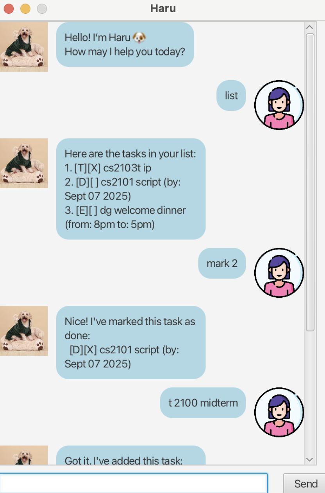

# Haru User Guide



Haru is a friendly chatbot that helps you manage
your tasks and deadlines through a simple,
conversational interface. You can add tasks, 
track deadlines, and interact with Haru in a 
chat-like window.

## Adding Todo

You can add a todo task by entering the
command in the chat box. Haru will record the
task and show it in your list of tasks.

Format: `todo TASK_NAME`
> **Note:** You may choose to replace `todo` with `t`.

Example: `todo submit report`

Haru will confirm that the deadline has been
added and display it in your task list:
```
Got it! I've added this task:
 [T][ ] submit report
Now you have 1 task in the list.
```

## Adding Deadline 

You can add a deadline task by entering the 
command in the chat box. Haru will record the 
task and show it in your list of tasks.

> **Note:** The date must be in `YYYY-MM-DD` format.

Format: `deadline TASK_NAME /by DATE`
> **Note:** You may choose to replace `deadline` with `d`.

Example: `deadline submit report /by 2025-09-15`

Haru will confirm that the deadline has been
added and display it in your task list:
```
Got it! I've added this task:
 [D][ ] submit report (by: Sep 15 2025)
Now you have 1 task in the list.
```

## Adding Event

You can add a event task by entering the
command in the chat box. Haru will record the
task and show it in your list of tasks.

Format: `event TASK_NAME /from DATE /to DATE`
> **Note:** You may choose to replace `event` with `e`.

Example: `event submit report /from 12pm /to 2pm`

Haru will confirm that the deadline has been
added and display it in your task list:
```
Got it! I've added this task:
 [E][ ] submit report (from: 12pm to: 2pm)
Now you have 1 task in the list.
```
## Viewing tasks

You can view all recorded tasks by entering the
command in the chat box. Haru will show your list 
of tasks.

Format: `list`
> **Note:** You may choose to replace `list` with `l`.

Example: `list`

Haru will display your task list:
```
Here are the tasks in your list:
 1. [T][ ] submit report
 2. [D][ ] submit report (by: Sep 15 2025)
 2. [E][ ] submit report (from 12pm to 2pm)
```

## Marking a task as completed

You can mark a task as completed so 
Haru knows you’ve finished it.

Format: `mark TASK_NUMBER`
> **Note:** You may choose to replace `mark` with `m`.

Example: `mark 1`

Haru will display your task list:
```
Nice! I've marked this task as done:
 [T][X] submit report
```

## Unmarking a task

You can unmark a task as uncomplete if you have 
accidentally marked it as completed.

Format: `unmark TASK_NUMBER`
> **Note:** You may choose to replace `unmark` with `u`.

Example: `unmark 1`

Haru will display your task list:
```
OK, I've unmarked this task as not done yet:
 [T][] submit report
```

## Finding a task 

You can find a task by entering the
command in the chat box.

Format: `find KEYWORD`
> **Note:** You may choose to replace `find` with `f`.

Example: `find submit report`

Haru will display your task list:
```
Here are the matching tasks in your list:
 1. [T][ ] submit report
 2. [D][ ] submit report (by: Sep 15 2025)
 2. [E][ ] submit report (from 12pm to 2pm)
```
## Deleting a task

You can delete a task by entering the
command in the chat box.

Format: `delete TASK_NUMBER`
> **Note:** You may choose to replace `delete` with `del`.

Example: `delete 1`

Haru will display your task list:
```
Noted. I've removed this task
 [T][ ] submit report
```

## Exiting the program

When you’re done, you can exit Haru with a simple 
command.

Format: `bye`

Example: `bye`

Haru will display your task list:
```
Goodbye! Hope to see you again soon.
```

